.. -*- coding: utf-8 -*-

.. _rcs_subversion:

Clase 05 - PIII 2018
====================
(Fecha: 19 de septiembre)

.. figure:: images/clase04/manejo_timers.png

**Ejercicio:** Probar cada una de estas afirmaciones (tomamos como ejemplo el Timer2):

- El Timer2 puede acumular pulsos tanto externos (TCS=1) a través del pin T1CK, como internos (TCS=0) al ritmo de la Frecuencia de instrucciones (Tcy).
- Acumulador de pulsos altos en TGate: puede contar los pulsos internos (Tcy) sólo cuando el pin externo T2CK esté a nivel alto, lo que permite contar la duración acumulada de una señal a nivel alto. Para seleccionar este modo hay que poner a 1 los bits TCS y TGATE.
- El interruptor que nos permite encender y apagar el Timer2 es el bit TON. 
- Los impulsos atraviesan el prescaler donde es dividido a razón de 1:1, 1:8, 1:64 y 1:256 en función de la combinación seleccionada en los bits TCKPS<1:0>.
- Se incrementa en una unidad el registro TMR2. En función del bit de configuración TSYNC, si su valor es 1 el incremento de dicho registro será sincronizado con una señal externa. Cada vez que se incrementa el registro TMR2, se compara con el registro PR2 y en caso de igualdad se pone a 0 el TMR2 y se señala el bit de interrupción T2IF. El registro PR2 por defecto vale 0xFFFF con lo que el periodo del Timer2 será ese, pero podemos ajustarlo al valor que queramos, lo que nos permite seleccionar una frecuencia de interrupción programable muy útil.
- Para hacerlos trabajar a 32 bits hay que poner a 1 el bit T32. En este caso, los bits de configuración del Timer de 32 bits serán los del Timer par; es decir, si queremos trabajar con la pareja Timer 2/3 hay que setear los bits del Timer2, incluyendo el bit T32=1.
- El bit de señalización de fin de periodo será el del Timer impar, en nuestro ejemplo se activará el bit T3IF. En el modo de trabajo a 32 bits, la palabra alta la forma el registro TMR impar y la palabra baja el TMR par.

.. figure:: images/clase04/map_timer1.png
   :target: http://ww1.microchip.com/downloads/en/devicedoc/70138c.pdf

.. figure:: images/clase04/map_timer23.png
   :target: http://ww1.microchip.com/downloads/en/devicedoc/70138c.pdf

.. figure:: images/clase04/map_timer45.png
   :target: http://ww1.microchip.com/downloads/en/devicedoc/70138c.pdf

.. figure:: images/clase04/ejemplo.png

.. code-block::

	void detectarIntT1() org 0x001a  {
	    LATBbits.LATB0 = !LATBbits.LATB0;
	    IFS0bits.T1IF=0;  // Borramos la bandera de interrupción T1
	}

	void main()  {
	    TRISBbits.TRISB0 = 0;
	    LATBbits.LATB0 = 0;

	    // Modo de operación Timer1
	    T1CON=0x0000;

	    // Modo operación Timer1: reloj interno, escala 1:1, empieza cuenta en 0
	    TMR1=0;

	    // Cuenta 500 ciclos
	    PR1=500;

	    // Interrupciones Timer1, borra Bandera de interrupción
	    IFS0bits.T1IF=0;

	    // Habilita interrupción
	    IEC0bits.T1IE=1;

	    // Arranca Timer1
	    T1CONbits.TON=1;

	    while(1)
	       asm nop;
	}

**Ejercicio:** 

- Mejorar la solución para el ejercicio de los leds encendiendo a 250 us y 133 us.

Conversor AD
============	

- Lleva a cabo la digitalización de las señales analógicas externas. 
- En la familia dsPIC30F hay dos versiones: 10 bits y 12 bits.
- Hay dos entradas analógicas para establecer una tensión de referencia externa: AVDD y AVSS (Vref+ y Vref-)
- Para controlar el ADC se usan 6 registros de control de 16 bits: 
	- ADCON1
	- ADCON2
	- ADCON3 sirve para seleccionar el modo del ADC
	- ADCHS para seleccionar las entradas analógicas
	- ADPCFG para seleccionar el pin utilizado como entrada analógica y el pin usado como pin de I/O
	- ADCSSL para seleccionar las entradas analógicas que serán escaneadas

- La conversión se guarda en un buffer de sólo lectura ADBUF0 a ADBUFF (16 palabras de 12 bits)

**Conversor AD de 12 bits**

.. figure:: images/clase04/adc.png

**Una secuencia de conversión**

- El proceso de adquisición de muestras se inicia activando el bit SAMP (este bit está en ADCON1)
- La conversión se puede iniciar por: bits de control programable, contador de tiempo o un evento externo
- Cuando el tiempo de conversión es completada, el resultado se carga en el buffer ADBUF0 a ADBUFF. 
- Al término de la conversión, el bit DONE (que está en ADCON1) y la bandera de interrupción se setean luego del número de muestras definidas por los bits de control SMPI (este bit está en ADCON2)

**Pasos para realizar una conversión AD:**

- Configurar el módulo AD
	- Configurar los pines como entradas analógicas, referencias de voltaje, y los pines digitales de I/O
	- Seleccionar un canal de entrada del convertidor AD
	- Seleccionar un reloj de conversión AD
	- Seleccionar una fuente de trigger (disparo)
	- Activar el módulo AD

- Iniciar el muestreo
- Esperar el tiempo de adquisición de muestras
- Fin de adquisición, inicia la conversión
- Esperar que se complete la conversión con el bit DONE
- Leer el buffer
	

ADC controlando los momentos de muestreo con el Timer2	
======================================================

.. figure:: images/clase04/ejemplo_adc1.png

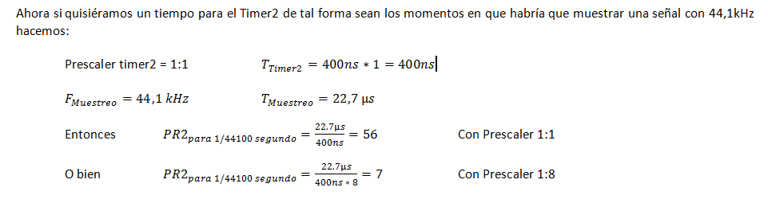

**Código fuente**

.. code-block::

	void initADC()  {
	    ADPCFG = 0xFFFE; // Elije la entrada analógica a convertir en este caso AN0.
	    // Con cero se indica entrada analógica y con 1 sigue siendo entrada digital.

	    ADCON1bits.ADON = 0;  // ADC Apagado por ahora
	    ADCON1bits.ADSIDL = 1;  // No trabaja en modo idle
	    ADCON1bits.FORM = 0b00;  // Formato de salida entero
	    // Para tomar muestras en forma manual. Porque lo vamos a controlar con timer2
	    ADCON1bits.SSRC = 0b000;  
	    // Adquiere muestra cuando el SAMP se pone en 1. SAMP lo controlamos desde el Timer2.
	    ADCON1bits.ASAM = 0;  

	    ADCON2bits.VCFG = 0b000;  // Referencia con AVdd y AVss
	    ADCON2bits.SMPI = 0b0000;  // Lanza interrupción luego de tomar n muestras.
	    // Con SMPI=0b0 -> 1 muestra ; Con SMPI=0b1 -> 2 muestras ; Con SMPI=0b10 -> 3 muestras ; etc.

	    // AD1CON3 no se usa ya que tenemos deshabilitado el cálculo del muestreo con ADCS etc.

	    // Muestreo la entrada analógica AN0 contra el nivel de AVss (AN0 es S/H+ y AVss es S/H-)
	    ADCHS = 0b0000;  

	    ADCON1bits.ADON = 1;// Habilitamos el A/D
	}

	void detectarIntT2() org 0x0020  {
	    IFS0bits.T2IF=0;  // Borramos la bandera de interrupción T2

	    ADCON1bits.DONE = 0;  // Antes de pedir una muestra ponemos en cero
	    ADCON1bits.SAMP = 1;  // Pedimos una muestra

	    asm nop;

	    ADCON1bits.SAMP = 0;  // Pedimos que retenga la muestra
	}

	void interrupcionADC() org 0x002a  {

	    LATCbits.LATC14 = !PORTCbits.RC14;  // Para debug y ver si ingresa acá

	    // Almacenamos los 8 bits más significativos
	    PORTBbits.RB1=ADCBUF0.B2;
	    PORTBbits.RB2=ADCBUF0.B3;
	    PORTBbits.RB3=ADCBUF0.B4;
	    PORTBbits.RB4=ADCBUF0.B5;
	    PORTBbits.RB5=ADCBUF0.B6;
	    PORTEbits.RE0=ADCBUF0.B7;
	    PORTEbits.RE1=ADCBUF0.B8;
	    PORTEbits.RE2=ADCBUF0.B9;

	    IFS0bits.ADIF = 0; // Borramos el flag de interrupciones
	}

	int main()  {

	    // Elegimos el puerto B y E para la salida digital.
	    // Ya que no alcanzan los pines para que todo salga por un único puerto
	    TRISB = 0;
	    TRISE = 0;

	    TRISCbits.TRISC14 = 0;  // Para debug nomás

	    // Configuramos el módulo ADC
	    initADC();

	    IEC0bits.ADIE = 1;  // Habilitamos interrupción del A/D

	    // Modo de operación Timer2 - Con el clock interno
	    T2CON = 0x0000;

	    // Prescaler para timer
	    // 00 -> 1:1 - 01 -> 1:8 - 10 -> 1:64 - 11 -> 1:256
	    T2CONbits.TCKPS = 0b01;

	    TMR2=0;
	    PR2=7;

	    IEC0bits.T2IE=1;  // Habilita interrupciones timer2

	    // Arrancamos el timer2
	    T2CONbits.TON=1;

	    while(1)  {  }

	    return 0;
	}

Registros
=========

.. figure:: images/clase04/registro_adc_todo.png
   :target: http://ww1.microchip.com/downloads/en/devicedoc/70138c.pdf

.. figure:: images/clase04/registro_adc1.png
   :target: http://ww1.microchip.com/downloads/en/DeviceDoc/70046E.pdf
	        
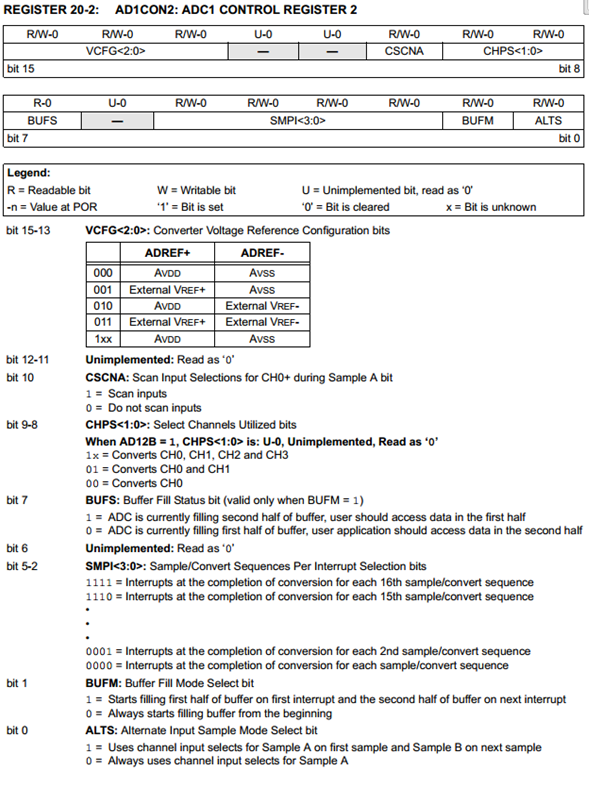
			
.. figure:: images/clase04/registro_adc3.png
   :target: http://ww1.microchip.com/downloads/en/DeviceDoc/70046E.pdf
			
.. figure:: images/clase04/registro_adc4.png
   :target: http://ww1.microchip.com/downloads/en/DeviceDoc/70046E.pdf

.. figure:: images/clase04/registro_adc5.png
   :target: http://ww1.microchip.com/downloads/en/DeviceDoc/70046E.pdf

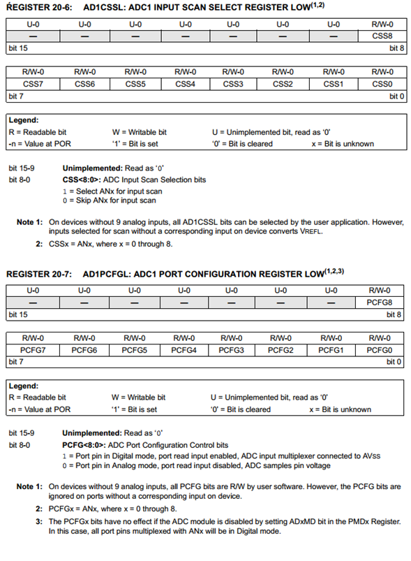

**Pinout de los dsPIC que utilizaremos**

.. figure:: images/clase05/dspic33fj32mc202.png
   :target: http://ww1.microchip.com/downloads/en/DeviceDoc/70283K.pdf

.. figure:: images/clase05/dspic30f4013.png
   :target: http://ww1.microchip.com/downloads/en/devicedoc/70138c.pdf
   
.. figure:: images/clase05/dspic30f3010.png
   :target: http://ww1.microchip.com/downloads/en/DeviceDoc/70141F.pdf

.. figure:: images/clase05/dspic30f4011.jpg
   :target: http://ww1.microchip.com/downloads/en/devicedoc/70135C.pdf

Ejemplo: ADC controlando los momentos de muestreo con señal cuadrada externa
========

- Para dsPIC33FJ32MC202
- Con flanco descendente de la señal cuadrada en el pin INT0
- Cristal de 10MHz
- ADC de 10 bits
- Entrada analógica en AN0

.. code-block::

	void config_adc()  {
	    ADPCFG = 0xFFFE; // Elije la entrada analogica a convertir en este caso AN0.
	    // Con cero se indica entrada analogica y con 1 sigue siendo entrada digital.

	    AD1CON1bits.ADON = 0;  // ADC apagado por ahora
	    AD1CON1bits.AD12B = 0;  // ADC de 10 bits
	    AD1CON1bits.FORM = 0b00;  // Formato de salida entero

	    // Para tomar muestras en forma manual. Porque lo vamos a controlar con senal externa en INT0
	    AD1CON1bits.SSRC = 0b000;

	    // Adquiere muestra cuando el SAMP se pone en 1. SAMP lo controlamos desde INT0
	    AD1CON1bits.ASAM = 0;

	    AD1CON2bits.VCFG = 0b000;  // Referencia con AVdd y AVss
	    AD1CON2bits.SMPI = 0b0000;  // Lanza interrupción luego de tomar n muestras.
	    // Con SMPI=0b0000 -> 1 muestra ; Con SMPI=0b0001 -> 2 muestras ; SMPI=0b0010 -> 3 ; etc.

	    // AD1CON3 no se usa ya que usamos muestreo manual

	    // Muestreo la entrada analogica AN0 contra el nivel de AVss (AN0 es S/H+ y AVss es S/H-)
	    AD1CHS0 = 0b0000;
	}

	void config_int0()  {
	    INTCON2bits.INT0EP = 1;  // 0 para Ascendente y 1 para Descendente
	}

	void config_ports()  {

	    TRISAbits.TRISA0 = 1;  // Entrada analogica para muestrear / AN0

	    // Elegimos los puertos RB0-RB6 y RB8-RB10
	    TRISBbits.TRISB0 = 0;  // Menos significativo
	    TRISBbits.TRISB1 = 0;
	    TRISBbits.TRISB2 = 0;
	    TRISBbits.TRISB3 = 0;
	    TRISBbits.TRISB4 = 0;
	    TRISBbits.TRISB5 = 0;
	    TRISBbits.TRISB6 = 0;
	    TRISBbits.TRISB8 = 0;
	    TRISBbits.TRISB9 = 0;
	    TRISBbits.TRISB10 = 0;  // Mas significativo

	    TRISBbits.TRISB7 = 1;  // Es el pin de la INT0

	    TRISBbits.TRISB11 = 0;  // Para debug ADC
	    TRISBbits.TRISB12 = 0;  // Para debug INT0
	}

	void detect_int0() org 0x0014  {
	    IFS0bits.INT0IF=0;  // Borramos la bandera de interrupción INT0

	    LATBbits.LATB12 = !LATBbits.LATB12;  // Para debug de la interrupcion INT0

	    AD1CON1bits.DONE = 0;  // Antes de pedir una muestra ponemos en cero
	    AD1CON1bits.SAMP = 1;  // Pedimos una muestra

	    asm nop;  // Tiempo que debemos esperar para que tome una muestra

	    AD1CON1bits.SAMP = 0;  // Pedimos que retenga la muestra
	}

	void detect_adc() org 0x002e  {

	    IFS0bits.AD1IF = 0; // Borramos el flag de interrupciones del ADC

	    LATBbits.LATB11 = !LATBbits.LATB11;  // Para debug de la interrupcion ADC

	    // Almacenamos los 8 bits más significativos
	    LATBbits.LATB0 = ADCBUF0.B0;
	    LATBbits.LATB1 = ADCBUF0.B1;
	    LATBbits.LATB2 = ADCBUF0.B2;
	    LATBbits.LATB3 = ADCBUF0.B3;
	    LATBbits.LATB4 = ADCBUF0.B4;
	    LATBbits.LATB5 = ADCBUF0.B5;
	    LATBbits.LATB6 = ADCBUF0.B6;
	    LATBbits.LATB8 = ADCBUF0.B7;
	    LATBbits.LATB9 = ADCBUF0.B8;
	    LATBbits.LATB10 = ADCBUF0.B9;
	}

	int main()  {
	    config_ports();
	    config_int0();
	    config_adc();

	    IEC0bits.INT0IE = 1;  // Habilitamos la interrupcion INT0

	    IEC0bits.AD1IE = 1;  // Habilitamos interrupción del ADC

	    AD1CON1bits.ADON = 1;  // Encendemos el ADC

	    while(1)  {  }

	    return 0;
	}
	
Ejemplo
^^^^^^^

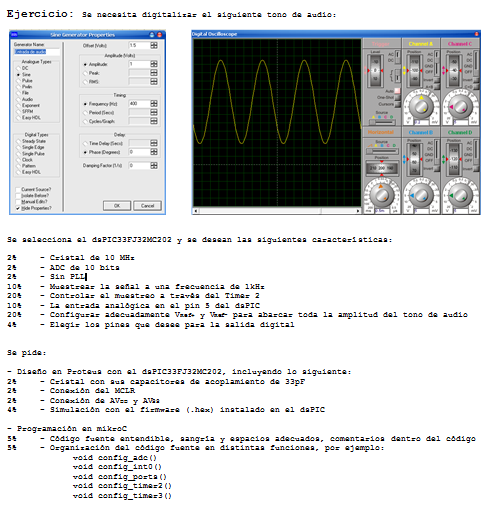
   
**Resolución**

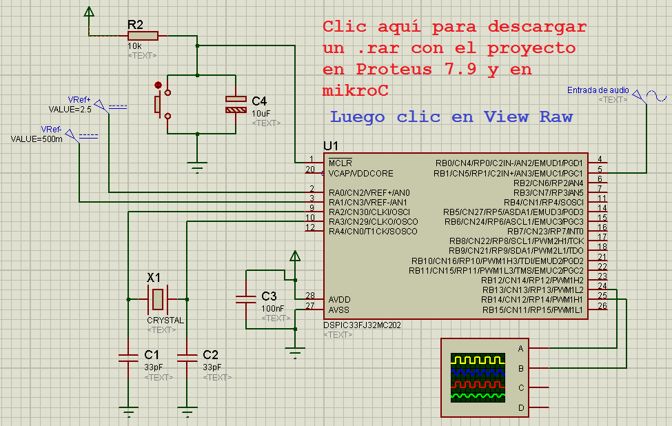
   
.. code-block:: c
   
	void config_adc()  {
		ADPCFG = 0xFFF7; // La entrada analogica es el AN3 (pin 5)
		// Con cero se indica entrada analogica y con 1 sigue siendo entrada digital.

		AD1CON1bits.ADON = 0;  // ADC apagado por ahora
		AD1CON1bits.AD12B = 0;  // ADC de 10 bits
		AD1CON1bits.FORM = 0b00;  // Formato de salida entero

		// Tomar muestras en forma manual, porque lo vamos a controlar con el Timer 2
		AD1CON1bits.SSRC = 0b000;

		// Adquiere muestra cuando el SAMP se pone en 1. SAMP lo controlamos desde el Timer 2
		AD1CON1bits.ASAM = 0;

		AD1CON2bits.VCFG = 0b011;  // Referencia con fuente externa VRef+ y VRef-
		AD1CON2bits.SMPI = 0b0000;  // Lanza interrupción luego de tomar n muestras.
		// Con SMPI=0b0000 -> 1 muestra ; Con SMPI=0b0001 -> 2 muestras ; SMPI=0b0010 -> 3 ; etc.

		// AD1CON3 no se usa ya que usamos muestreo manual

		// Muestreo la entrada analogica AN3 contra el nivel de VRef+ y VRef-
		AD1CHS0 = 0b00011;
	}

	void config_timer2()  {
		// Prescaler 1:1   -> TCKPS = 0b00 -> Incrementa 1 en un ciclo de instruccion
		// Prescaler 1:8   -> TCKPS = 0b01 -> Incrementa 1 en 8 ciclos de instruccion
		// Prescaler 1:64  -> TCKPS = 0b10 -> Incrementa 1 en 64 ciclos de instruccion
		// Prescaler 1:256 -> TCKPS = 0b11 -> Incrementa 1 en 256 ciclos de instruccion
		T2CONbits.TCKPS = 0b00;

		// Empieza cuenta en 0
		TMR2=0;

		// Cuenta hasta 5000 ciclos y dispara interrupcion
		PR2=5000;  // 5000 * 200 nseg = 1 mseg   ->  1 / 1mseg = 1000Hz
	}

	void config_ports()  {
		TRISAbits.TRISA3 = 1;  // Entrada para muestrear = AN3

		// Elegimos los puertos RB2-RB11 para la salida digital
		TRISBbits.TRISB2 = 0;  // Menos significativo
		TRISBbits.TRISB3 = 0;
		TRISBbits.TRISB4 = 0;
		TRISBbits.TRISB5 = 0;
		TRISBbits.TRISB6 = 0;
		TRISBbits.TRISB7 = 0;
		TRISBbits.TRISB8 = 0;
		TRISBbits.TRISB9 = 0;
		TRISBbits.TRISB10 = 0;
		TRISBbits.TRISB11 = 0;  // Mas significativo

		TRISBbits.TRISB13 = 0;  // Para debug Timer 2
		TRISBbits.TRISB14 = 0;  // Para debug ADC
	}

	void detect_timer2() org 0x0022  {
		IFS0bits.T2IF=0;  // Borramos la bandera de interrupción Timer 2

		LATBbits.LATB13 = !LATBbits.LATB13;  // Para debug de la interrupcion Timer 2

		AD1CON1bits.DONE = 0;  // Antes de pedir una muestra ponemos en cero
		AD1CON1bits.SAMP = 1;  // Pedimos una muestra

		asm nop;  // Tiempo que debemos esperar para que tome una muestra

		AD1CON1bits.SAMP = 0;  // Pedimos que retenga la muestra
	}

	void detect_adc() org 0x002e  {
		IFS0bits.AD1IF = 0; // Borramos el flag de interrupciones del ADC

		LATBbits.LATB14 = !LATBbits.LATB14;  // Para debug de la interrupcion ADC

		// Almacenamos los 10 bits del ADC
		LATBbits.LATB2 = ADCBUF0.B0;
		LATBbits.LATB3 = ADCBUF0.B1;
		LATBbits.LATB4 = ADCBUF0.B2;
		LATBbits.LATB5 = ADCBUF0.B3;
		LATBbits.LATB6 = ADCBUF0.B4;
		LATBbits.LATB7 = ADCBUF0.B5;
		LATBbits.LATB8 = ADCBUF0.B6;
		LATBbits.LATB9 = ADCBUF0.B7;
		LATBbits.LATB10 = ADCBUF0.B8;
		LATBbits.LATB11 = ADCBUF0.B9;
	}

	int main()  {
		config_ports();
		config_timer2();
		config_adc();

		// Habilitamos interrupción del ADC y lo encendemos
		IEC0bits.AD1IE = 1;
		AD1CON1bits.ADON = 1;

		// Habilita interrupción del Timer 2 y lo iniciamos para que comience a contar
		IEC0bits.T2IE=1;
		T2CONbits.TON=1;

		while(1)  {  }

		return 0;
	}

Ejercicio 5:
============

- Adaptarlo para llevarlo a la placa Easy dsPIC con el dsPIC30F4013

Recomendaciones para crear un proyecto
^^^^^^^^^^^^^^^^^^^^^^^^^^^^^^^^^^^^^^

- Crear carpeta en disco ( C:/UBP/PIII/NombreProyecto )
- Nomenclatura de ejemplo para NombreProyecto
	- P30F_Ej05
	- P33F_Ej12
	- P33F_Generador100Hz
	- P33F_AlgunaDescripcion
- Dentro de esta carpeta crear las carpetas Proteus y MikroC para los 33F o sólo la carpeta MikroC para los 30F.
- Abrir mikroC -- New Porject -- Standard project -- Next
- Project Name: P33F_Ej12 (Notar que estamos colocando el mismo nombre que la carpeta)
- Project folder: C:/UBP/PIII/P33F_Ej12/MikroC
- Device Name: P33FJ32MC202
- Next -- Include None -- Finish
- Al guardar y compilar este proyecto, entre todos los archivos que se generan, los siguientes son los más importantes:
	- P33F_Ej12.mcdps - Archivo de configuración del proyecto. 
	- P33F_Ej12.c - Código fuente en C (Es el código escrito por nosotros)
	- P33F_Ej12.asm - Código fuente en assembler (se autogenera al compilar el proyecto)
	- P33F_Ej12.hex - Usado para programar el dsPIC (se autogenera al compilar el proyecto)
- Escribir el programa. No olvidar lo siguiente:
	- Edit Project ( para ajustar el PLL )
	- Estilo de indentación: Ubicación de llaves, sangría adecuada, espacios, etc..
	- Elección apropiada para nombres de variables y funciones.

- Abrir Proteus ( sólo para los 33F )
- Al guardar el diseño, almacenarlo con el mismo nombre del proyecto ( por ejemplo: P33F_Ej12.DSN )
- En Proteus 7.9, el archivo P33F_Ej12.DSN contiene todo lo referido al proyecto
- En la carpeta C:/UBP/PIII/P33F_Ej12/Proteus

Generador de señales
^^^^^^^^^^^^^^^^^^^^

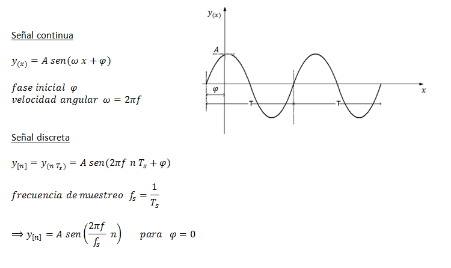

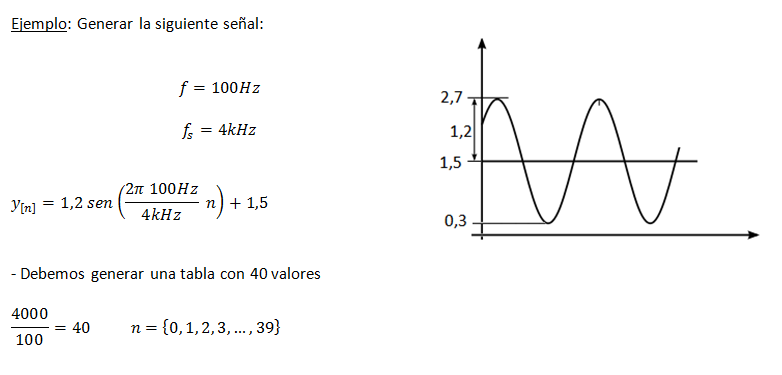

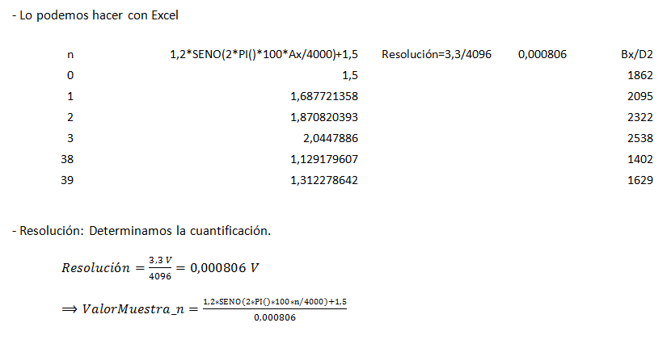

.. figure:: images/clase07/planilla_excel.png
   :target: resources/clase07/Generador.xlsx
   
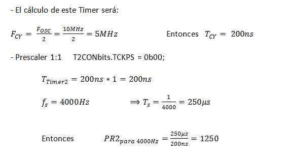

.. code-block:: c

	// Ejemplo para dsPIC33FJ32MC202
	int pos = 0;
	int valorActual = 0;

	int seno[40] = { 1862,2095,2322,2538,2737,2915,3067,3189,3278,3333,
	                 3351,3333,3278,3189,3067,2915,2737,2538,2322,2095,
	                 1862,1629,1402, 1186,986, 809, 657, 535, 445, 391,
	                 372, 391, 445, 535, 657, 809, 986, 1186,1402,1629 };
			 
	void detectarInt_T2() org 0x0022  {
	    IFS0bits.T2IF = 0;
		 
	    LATBbits.LATB15 = !LATBbits.LATB15;

	    valorActual = seno[pos];

	    LATBbits.LATB2 =  (valorActual & 0b0000100000000000) >> 11;
	    LATBbits.LATB3 =  (valorActual & 0b0000010000000000) >> 10;
	    LATBbits.LATB4 =  (valorActual & 0b0000001000000000) >> 9;
	    LATBbits.LATB5 =  (valorActual & 0b0000000100000000) >> 8;
	    LATBbits.LATB6 =  (valorActual & 0b0000000010000000) >> 7;
	    LATBbits.LATB7 =  (valorActual & 0b0000000001000000) >> 6;
	    LATBbits.LATB8 =  (valorActual & 0b0000000000100000) >> 5;
	    LATBbits.LATB9 =  (valorActual & 0b0000000000010000) >> 4;
	    LATBbits.LATB10 = (valorActual & 0b0000000000001000) >> 3;
	    LATBbits.LATB11 = (valorActual & 0b0000000000000100) >> 2;
	    LATBbits.LATB12 = (valorActual & 0b0000000000000010) >> 1;
	    LATBbits.LATB13 = (valorActual & 0b0000000000000001) >> 0;

	    pos = pos + 1;

	    if (pos >= 40)  {
	        pos = 0;
	    }
	}

	void configuracionPuertos()  {

	    TRISBbits.TRISB2 = 0;  // Bit menos significativo de la senal generada
	    TRISBbits.TRISB3 = 0;
	    TRISBbits.TRISB4 = 0;
	    TRISBbits.TRISB5 = 0;
	    TRISBbits.TRISB6 = 0;
	    TRISBbits.TRISB8 = 0;
	    TRISBbits.TRISB9 = 0;
	    TRISBbits.TRISB10 = 0;
	    TRISBbits.TRISB11 = 0;
	    TRISBbits.TRISB12 = 0;
	    TRISBbits.TRISB13 = 0;  // Bit mas significativo de la senal generada

	    TRISBbits.TRISB15 = 0;  // Debug Timer 2
	}

	void configuracionT2()  {
	    T2CONbits.TCKPS = 0b00;  // prescaler = 1:1
	    PR2 = 1250;  // Genera interrupcion del Timer 2 a 4kHz

	    IEC0bits.T2IE = 1;
	}

	int main()  {
	    configuracionPuertos();
	    configuracionT2();

	    T2CONbits.TON = 1;

	    while(1)  {
	    }

	    return 0;
	}

**¿Cómo visualizamos la señal generada? Con un DAC R-2R**

.. figure:: images/clase07/dac_r_2r.png

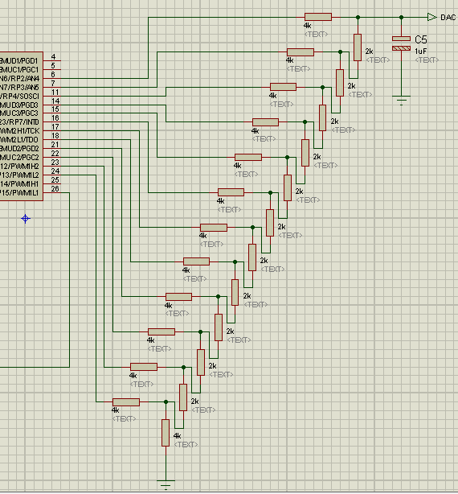

**Ejemplo:**

- Generador de señal con dsPIC30F4013
- Video demostración en: https://www.youtube.com/watch?v=liTtwFMcNQ0

.. code-block:: c

	// Generador de señal para 4013

	int pos = 0;
	int valorActual = 0;

	int seno[40] = { 1862,2095,2322,2538,2737,
	                 2915,3067,3189,3278,3333,
	                 3351,3333,3278,3189,3067,
	                 2915,2737,2538,2322,2095,
	                 1862,1629,1402, 1186,986, 
	                 809, 657, 535, 445, 391,
	                 372, 391, 445, 535, 657, 
	                 809, 986, 1186,1402,1629 };

	void interrupt_T2() org 0x0020  {
	    IFS0bits.T2IF = 0;

	    LATCbits.LATC15 = !LATCbits.LATC15;

	    valorActual = seno[pos];

	    LATCbits.LATC14 = (valorActual & 0b0000100000000000) >> 11;
	    LATBbits.LATB2 =  (valorActual & 0b0000010000000000) >> 10;
	    LATBbits.LATB3 =  (valorActual & 0b0000001000000000) >> 9;
	    LATBbits.LATB4 =  (valorActual & 0b0000000100000000) >> 8;
	    LATBbits.LATB5 =  (valorActual & 0b0000000010000000) >> 7;
	    LATBbits.LATB6 =  (valorActual & 0b0000000001000000) >> 6;
	    LATBbits.LATB8 =  (valorActual & 0b0000000000100000) >> 5;
	    LATBbits.LATB9 =  (valorActual & 0b0000000000010000) >> 4;
	    LATBbits.LATB10 = (valorActual & 0b0000000000001000) >> 3;
	    LATBbits.LATB11 = (valorActual & 0b0000000000000100) >> 2;
	    LATBbits.LATB12 = (valorActual & 0b0000000000000010) >> 1;
	    LATCbits.LATC13 = (valorActual & 0b0000000000000001) >> 0;

	    pos = pos + 1;

	    if (pos >= 40)  {
	        pos = 0;
	    }
	}

	void config_puertos()  {

	    TRISCbits.TRISC14 = 0;  // Bit mas significativo de la senal generada
	    TRISBbits.TRISB2 = 0;
	    TRISBbits.TRISB3 = 0;
	    TRISBbits.TRISB4 = 0;
	    TRISBbits.TRISB5 = 0;
	    TRISBbits.TRISB6 = 0;
	    TRISBbits.TRISB8 = 0;
	    TRISBbits.TRISB9 = 0;
	    TRISBbits.TRISB10 = 0;
	    TRISBbits.TRISB11 = 0;
	    TRISBbits.TRISB12 = 0;
	    TRISCbits.TRISC13 = 0;  // Bit menos significativo de la senal generada

	    TRISCbits.TRISC15 = 0;  // Debug Timer 2
	}

	void config_T2()  {
	    T2CONbits.TCKPS = 0b00;  // prescaler = 1:1
	    PR2 = 1250;  // Genera interrupcion del Timer 2 a 4kHz

	    IEC0bits.T2IE = 1;
	}

	int main()  {
	    config_puertos();
	    config_T2();

	    T2CONbits.TON = 1;

	    while(1)  {
	    }

	    return 0;
	}

Ejercicio:
==========

- Generar una señal de 4Hz pensado para aplicar un efecto trémolo (variación periódica del volumen) a una señal de audio que está siendo muestreada a 4kHz.
- Si el array tiene demasiados valores, pensar en cómo se podría resolver sabiendo que una senoidal tiene simetría.

Ejercicio 6:
============

- Generar una señal de 5Hz pensado para aplicar un efecto trémolo (variación periódica del volumen) a una señal de audio que está siendo muestreada a 1kHz.

Ejercicio 7:
============

- Aplicar el trémolo de 5Hz a la señal generada de 100Hz.

.. figure:: images/clase07/captura_tremolo.png

Ejercicio 8:
============

- Muestrear una señal de audio y aplicar el trémolo anterior.

Ejercicio 9:
============

Muestrear una señal analógica (100 Hz, offset de 2 V y 4 Vpp), aplicarle un trémolo y mostrar la resultante luego de un DAC R-2R.

**Especificaciones:**

- Entrada por AN2
- Utilizar Vref+ y Vref- con valores óptimos
- Entíendase el trémolo como una señal modulante con la que se logra un índice de modulación particular (ver Variaciones por alumno)
- Frecuencia de muestreo: 1 kHz
- ADC de 12 bits
- Definir una frecuencia del trémolo particular (ver Variaciones por alumno)

**Entregar:**

- Proyecto en mikroC
- Captura de pantalla del osciloscopio con la señal resultante
- Video de algunos segundos mostrando el conexionado y la visualización en el osciloscopio

**Variaciones por alumno:**

:Agustina:
    Frecuencia del trémolo: 2 Hz
	
    Índice de modulación del 20%

:Ignacio:
    Frecuencia del trémolo: 4 Hz
	
    Índice de modulación del 30%

:Julián:
    Frecuencia del trémolo: 6 Hz
	
    Índice de modulación del 40%

:Facundo:
    Frecuencia del trémolo: 8 Hz
	
    Índice de modulación del 50%

**Ejemplo que sirve de guía:** 

- `Solución de un ejercicio parecido en Proteus <https://github.com/cosimani/Curso-PIII-2016/blob/master/resources/clase06/Ej1.rar?raw=true>`_

.. figure:: images/clase06/Ej1-Esquema.png

.. figure:: images/clase06/Ej1-Osciloscopio.png

**ADC automático para dsPIC30F4013**

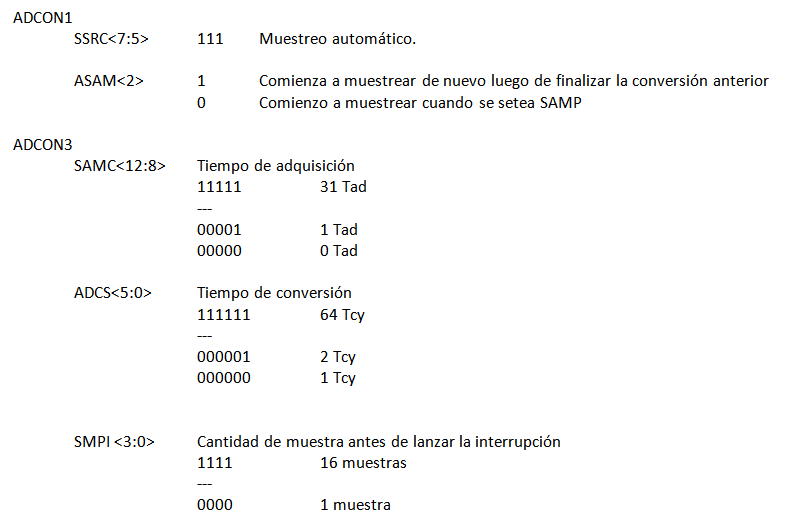

.. figure:: images/clase08/adc_auto_2.png

.. figure:: images/clase08/adc_auto_3.png

**Ejemplo:** Realizar cálculo para muestrear la voz humana

.. figure:: images/clase08/adc_auto_ejer_1.png

.. figure:: images/clase08/adc_auto_ejer_2.png

Ejercicio 10:
============
- Programar esto y controlar con el EasydsPIC si la frecuencia de muestreo está bien.

Ejercicio 11:
============

- Adaptar el programa para el dsPIC33FJ32MC202 y controlarlo en Proteus.

**Código de ejemplo**

.. code-block:: c

	unsigned int contador = 0;

	void detectar_adc() org 0x002a  {
	    contador = contador + 1;
	    if (contador > 2000)  {  // Para que D1 cambie de estado cada 1 segundo
	        LATDbits.LATD1 = ~LATDbits.LATD1;
	        contador = 0;
	    }

	    IFS0bits.ADIF = 0;
	}

	void config_adc()  {
	    ADPCFG = 0xFFFD;  // Elegimos la entrada analógica

	    ADCON1bits.ADSIDL = 1;  // No trabaja en modo IDLE (modo bajo consumo - CPU off, Peripherals on)
	    ADCON1bits.FORM = 0b00;  // Formato de salida entero
	    ADCON1bits.SSRC = 0b111;  // Muestreo automatico
	    ADCON1bits.ASAM = 1;  // Comienza a muestrear luego de la conversion anterior

	    ADCON2bits.VCFG = 0b000;  // Referencia AVdd y AVss
	    ADCON2bits.SMPI = 0b0000;  // Lanza interrupcion luego de n muestras
	    // 0b0000 - 1 muestra / 0b0001 - 2 muestras / 0b0010 - 3 muestras

	    ADCON3bits.SAMC = 31;
	    ADCON3bits.ADCS = 55;

	    ADCHSbits.CH0SA = 0b0001;  // 0b0000 para AN0 / 0b0001 para AN1 / 0b0010 para AN2

	    ADCON1bits.ADON = 1;
	}

	void configuracionPuertos()  {
	    // Para LEDs de debug
	    TRISDbits.TRISD1 = 0;  // Debug IntADC
	}

	void main()  {
	    configuracionPuertos();

	    config_adc();

	    IEC0bits.ADIE = 1;

	    while(1)  {
	    }
	}

**Práctico sobre modulación en amplitud charlado en clase**

.. figure:: images/clase07/am1.png

.. figure:: images/clase07/am2.png
