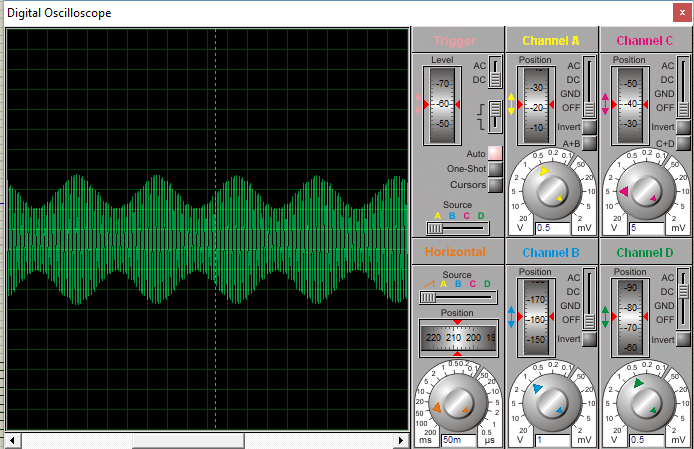

.. -*- coding: utf-8 -*-

.. _rcs_subversion:

Clase 05 - PIII 2018
====================
(Fecha: 19 de septiembre)

Ejercicio:
==========

- Generar una señal de 4Hz pensado para aplicar un efecto trémolo (variación periódica del volumen) a una señal de audio que está siendo muestreada a 4kHz.
- Si el array tiene demasiados valores, pensar en cómo se podría resolver sabiendo que una senoidal tiene simetría.

Ejercicio 6:
============

- Generar una señal de 5Hz pensado para aplicar un efecto trémolo (variación periódica del volumen) a una señal de audio que está siendo muestreada a 1kHz.

Ejercicio 7:
============

- Aplicar el trémolo de 5Hz a la señal generada de 100Hz.

.. figure:: images/clase07/captura_tremolo.png

Ejercicio 8:
============

- Muestrear una señal de audio y aplicar el trémolo anterior.

Ejercicio 9:
============

Muestrear una señal analógica (100 Hz, offset de 2 V y 4 Vpp), aplicarle un trémolo y mostrar la resultante luego de un DAC R-2R.

**Especificaciones:**

- Entrada por AN2
- Utilizar Vref+ y Vref- con valores óptimos
- Entíendase el trémolo como una señal modulante con la que se logra un índice de modulación particular (ver Variaciones por alumno)
- Frecuencia de muestreo: 1 kHz
- ADC de 12 bits
- Definir una frecuencia del trémolo particular (ver Variaciones por alumno)

**Entregar:**

- Proyecto en mikroC
- Captura de pantalla del osciloscopio con la señal resultante
- Video de algunos segundos mostrando el conexionado y la visualización en el osciloscopio

**Variaciones por alumno:**

:Agustina:
    Frecuencia del trémolo: 2 Hz
	
    Índice de modulación del 20%

:Ignacio:
    Frecuencia del trémolo: 4 Hz
	
    Índice de modulación del 30%

:Julián:
    Frecuencia del trémolo: 6 Hz
	
    Índice de modulación del 40%

:Facundo:
    Frecuencia del trémolo: 8 Hz
	
    Índice de modulación del 50%

**Ejemplo que sirve de guía:** 

- `Solución de un ejercicio parecido en Proteus <https://github.com/cosimani/Curso-PIII-2016/blob/master/resources/clase06/Ej1.rar?raw=true>`_

.. figure:: images/clase06/Ej1-Esquema.png

**ADC automático para dsPIC30F4013**

.. figure:: images/clase08/adc_auto_1.png

**Ejemplo:** Realizar cálculo para muestrear la voz humana

.. figure:: images/clase08/adc_auto_ejer_2.png

Ejercicio 10:
============
- Programar esto y controlar con el EasydsPIC si la frecuencia de muestreo está bien.

Ejercicio 11:
============

- Adaptar el programa para el dsPIC33FJ32MC202 y controlarlo en Proteus.

**Código de ejemplo**

.. code-block:: c

	unsigned int contador = 0;

	void detectar_adc() org 0x002a  {
	    contador = contador + 1;
	    if (contador > 2000)  {  // Para que D1 cambie de estado cada 1 segundo
	        LATDbits.LATD1 = ~LATDbits.LATD1;
	        contador = 0;
	    }

	    IFS0bits.ADIF = 0;
	}

	void config_adc()  {
	    ADPCFG = 0xFFFD;  // Elegimos la entrada analógica

	    ADCON1bits.ADSIDL = 1;  // No trabaja en modo IDLE (modo bajo consumo - CPU off, Peripherals on)
	    ADCON1bits.FORM = 0b00;  // Formato de salida entero
	    ADCON1bits.SSRC = 0b111;  // Muestreo automatico
	    ADCON1bits.ASAM = 1;  // Comienza a muestrear luego de la conversion anterior

	    ADCON2bits.VCFG = 0b000;  // Referencia AVdd y AVss
	    ADCON2bits.SMPI = 0b0000;  // Lanza interrupcion luego de n muestras
	    // 0b0000 - 1 muestra / 0b0001 - 2 muestras / 0b0010 - 3 muestras

	    ADCON3bits.SAMC = 31;
	    ADCON3bits.ADCS = 55;

	    ADCHSbits.CH0SA = 0b0001;  // 0b0000 para AN0 / 0b0001 para AN1 / 0b0010 para AN2

	    ADCON1bits.ADON = 1;
	}

	void configuracionPuertos()  {
	    // Para LEDs de debug
	    TRISDbits.TRISD1 = 0;  // Debug IntADC
	}

	void main()  {
	    configuracionPuertos();

	    config_adc();

	    IEC0bits.ADIE = 1;

	    while(1)  {
	    }
	}

**Práctico sobre modulación en amplitud charlado en clase**

