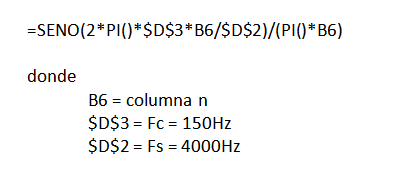

.. -*- coding: utf-8 -*-

.. _rcs_subversion:

Clase 06 - PIII 2018
====================
(Fecha: 26 de septiembre)

Programación de filtros
^^^^^^^^^^^^^^^^^^^^^^^	
	
**Función de transferencia**

- Relación entre la entrada y la salida al pasar por el proceso
- Se manipulan en términos de la frecuencia compleja y no del tiempo continuo para simplificar
- Las funciones de transferencia en tiempo discreto se hace en término de la variable compleja z
- Se recurre a la transformada Z que representa la frecuencia compleja para tiempo discreto

.. figure:: images/clase08/filtros_1.png

- Para el tratamiento real en término del tiempo discreto se realiza la transformada inversa de z
- La transformación inversa de la ecuación anterior queda en función del tiempo discreto queda:

.. figure:: images/clase08/filtros_2.png

- Esto es una convolución
- El número máximo que asume n es M
- M determina el orden de la función de transferencia

- FIR: Sistema sin memoria. Convolución con muestras pasadas y actuales.
- IIR: Sistema con memoria. Convolución con muestras pasadas y actuales, y también salidas pasadas y(n)

- FIR: Fácil implementación y diseño pero consumen más recursos
- IIR: Más matemática pero requieren campos de memoria más pequeños

**Convolución en C**

**El código puede ser:**

.. code-block:: c

	#define M 17
	float x[ M ];
	float h[ M ];

	float yn = 0;
	short k;
	
	for ( k = M - 1 ; k >= 1 ; k-- )
	    x[ k ] = x[ k-1 ];
		
	x[ 0 ] = x0;  // x0 es la muestra actual
	
	for ( k = 0 ; k < M ; k++ )
	    yn += h[ k ] * x[ k ];

**Función de transferencia: Filtro pasa bajos**

.. figure:: images/clase08/filtros_4.png

- Lo podemos calcular con el Excel

.. figure:: images/clase08/filtros_6.png

**Ejemplo Filtro FIR**

- Fs = 4000
- Fc = 150Hz

.. code-block:: c

	#define M 17
	float x[M];
	float h[M] = 
	    {0.037841336, 0.045332663, 0.052398494, 0.058815998, 0.064379527,
	    0.068908578, 0.072254832, 0.074307967, 0.075, 0.074307967, 0.072254832, 0.068908578,
	    0.064379527, 0.058815998, 0.052398494, 0.045332663, 0.037841336};

	float yn=0;

	unsigned int i;
	short k;
	float valorActual = 0;

	void  detectarIntADC()  org 0x002E  {
	    IFS0bits.AD1IF=0;

	    for (k=M-1 ; k>=1 ; k--)  {
	        x[k] = x[k-1];
	    }

	    //Se guarda la última muestra.
	    x[0] = ((float)ADC1BUF0-2048);

	    yn = 0;

	    for (k=0 ; k<M ; k++)  {
	        yn += h[k]*x[k];
	    }

	    valorActual = yn + 2048;

	    LATBbits.LATB2 =   ((unsigned int)valorActual & 0b0000100000000000) >> 11;
	    LATBbits.LATB3 =   ((unsigned int)valorActual & 0b0000010000000000) >> 10;
	    LATBbits.LATB4 =   ((unsigned int)valorActual & 0b0000001000000000) >> 9;
	    LATBbits.LATB5 =   ((unsigned int)valorActual & 0b0000000100000000) >> 8;
	    LATBbits.LATB6 =  ((unsigned int)valorActual &  0b0000000010000000) >> 7;
	    LATBbits.LATB7 =  ((unsigned int)valorActual &  0b0000000001000000) >> 6;
	    LATBbits.LATB8 =  ((unsigned int)valorActual &  0b0000000000100000) >> 5;
	    LATBbits.LATB9 =  ((unsigned int)valorActual &  0b0000000000010000) >> 4;
	    LATBbits.LATB10 = ((unsigned int)valorActual &  0b0000000000001000) >> 3;
	    LATBbits.LATB11 = ((unsigned int)valorActual &  0b0000000000000100) >> 2;
	    LATBbits.LATB12 = ((unsigned int)valorActual &  0b0000000000000010) >> 1;
	    LATBbits.LATB13 = ((unsigned int)valorActual &  0b0000000000000001) >> 0;
	}

	void detectarIntT2() org 0x0022  {

	    IFS0bits.T2IF=0;  //borra bandera de interrupcion de TIMER2

	    LATBbits.LATB15=~LATBbits.LATB15;

	    AD1CON1bits.SAMP=1; //pedimos muestras
	    asm nop;  //ciclo instruccion sin operacion
	    AD1CON1bits.SAMP=0;  //retener muestra e inicia conversion
	}

	void configADC()  {
	    AD1PCFGL=0b111011;  //elegimos AN2 como entrada para muestras
	    AD1CHS0 =0b0010; //usamos AN2 para recibir las muestras en el ADC
	    AD1CON1bits.SSRC=0b000; //muestreo manual
	    AD1CON1bits.ADON=0;  //apagamos ADC
	    AD1CON1bits.AD12B=1;  //12bits S&H ADC1
	    AD1CON2bits.VCFG=0b011;  //tension de referencia externa Vref+ Vref-
	    IEC0bits.AD1IE=1;  //habilitamos interrupcion del ADC
	}

	void configTIMER2()  {
	    T2CON=0x0000;   //registro de control de TIMER2 a cero
	    T2CONbits.TCKPS=0b00;// prescaler = 1
	    TMR2=0;  //desde donde va a arrancar la cuenta
	    PR2=1250;   //hasta donde cuenta segun calculo para disparo de TIMER2
	    IEC0bits.T2IE=1; //habilitamos interrupciones para TIMER2
	}

	void configPuertos()  {
	    TRISBbits.TRISB2 = 0;
	    TRISBbits.TRISB3 = 0;
	    TRISBbits.TRISB4 = 0;
	    TRISBbits.TRISB5 = 0;
	    TRISBbits.TRISB6 = 0;
	    TRISBbits.TRISB7 = 0;
	    TRISBbits.TRISB8 = 0;
	    TRISBbits.TRISB9 = 0;
	    TRISBbits.TRISB10 = 0;
	    TRISBbits.TRISB11 = 0;
	    TRISBbits.TRISB12 = 0;
	    TRISBbits.TRISB13 = 0;

	    TRISBbits.TRISB15=0;  // Debug T2
	}

	void main()  {
	    configPuertos();
	    configTIMER2();
	    configADC();

	    AD1CON1bits.ADON = 1;

	    T2CONbits.TON=1;

	    while(1)  {
	    }
	}

**Material extra de consulta sobre filtros**		

.. figure:: images/clase08/portada-material-consulta-filtros.png
	:target: images/clase08/material-consulta-filtros.pdf

Ejercicio 12:
============

- Programar esto y controlar en Proteus. 
- Analizar si la frecuencia de muestreo es la misma con el ADC encendido y apagado. Es decir, realizando el procesamiento de la señal o no.
- De ser necesario, definir una frecuencia de muestreo tal que no se vea afectado el procesamiento.
- Identificar cuál es la frecuencia máxima a la que se podría muestrear.

Ejercicio 13:
============

- Calcular esa frecuencia máxima para el ADC automático.
