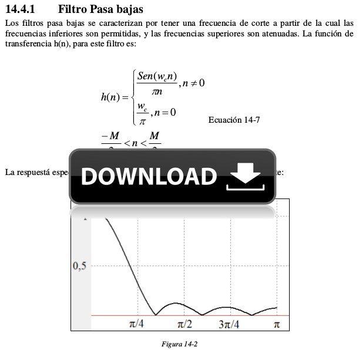
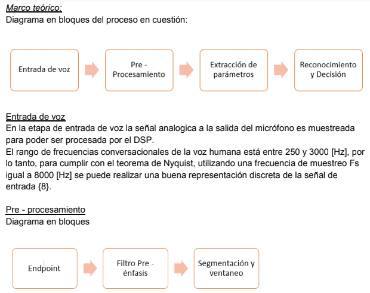

.. -*- coding: utf-8 -*-

.. _rcs_subversion:

Clase 13 - PIII 2018
====================
(Fecha: 21 de noviembre)

**Material extra de consulta sobre filtros**		

Ejercicio 12:
============

- Programar esto y controlar en Proteus. 
- Analizar si la frecuencia de muestreo es la misma con el ADC encendido y apagado. Es decir, realizando el procesamiento de la señal o no.
- De ser necesario, definir una frecuencia de muestreo tal que no se vea afectado el procesamiento.
- Identificar cuál es la frecuencia máxima a la que se podría muestrear.

Ejercicio 13:
============

- Calcular esa frecuencia máxima para el ADC automático.

Primera entrega de prácticos finales
====================================

.. figure:: resources/clase07/espacio-vertical.png

**Identificador de tonos DTMF ( Agustina Alvarez - Carlos Ignacio )** 

( Clic sobre la siguiente imagen para abrir el informe en PDF )

.. figure:: resources/clase07/PrimeraEntrega-Agustina-Carlos.png
	:target: resources/clase07/PrimeraEntrega-Agustina-Carlos.pdf

.. figure:: resources/clase07/espacio-vertical.png

**Reconocimiento de voz ( Karraz Facundo - Gutierrez Julian )** 

( Clic sobre la siguiente imagen para abrir el informe en PDF )

