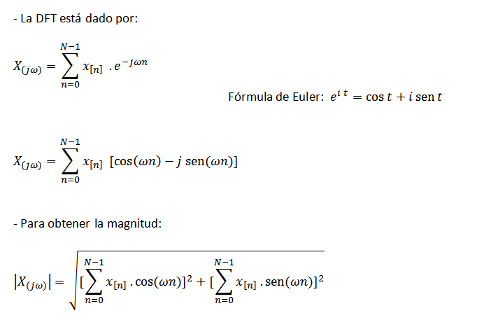
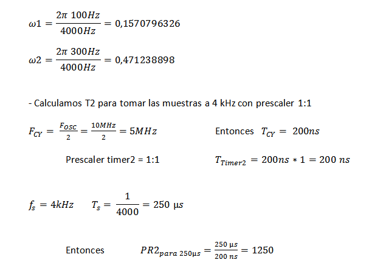

.. -*- coding: utf-8 -*-

.. _rcs_subversion:

Clase 16 - PIII 2018
====================
(Fecha: 21 de noviembre)

**Transformada Discreta de Fourier (DFT)**

- Esta última ecuación escrita en C quedaría:

.. code-block:: c

	float dft( float *x_n, float w, unsigned int NN )  {
	    unsigned short n;
	    float R=0.0, I=0.0;

	    // Bucle for para realizar las sumatorias.
	    for( n=0 ; n<NN ; n++ )  {
	        // Cálculo y sumatoria de los componentes
	        // reales e imaginarios.
	        R += x_n[ n ] * cos( w*n );
	        I += x_n[ n ] * sin( w*n );
	    }

	    return sqrt( R*R + I*I ); 
	}

.. figure:: images/clase11/im2.png	

**Ejemplo:** Deseamos averiguar la presencia de frecuencias de 100 Hz y 300 Hz en una señal de audio muestreada a 4kHz.

.. code-block:: c

	void  detectarIntADC()  org 0x002E  {
	    IFS0bits.AD1IF=0;

	    // Se corren las últimas 64 muestras en el bufer x.
	    for( i=63; i!=0; i-- )
	        x[ i ] = x[ i-1 ];

	    // Se guarda la última muestra.
	    x[0] = ( (float) ADC1BUF0 );

	    cont = cont + 1;  // Se cuentan las muestras tomadas.

	    if ( cont == 64 )  {  // Se espera a recibir 64 muestras.

	        resultado1 = dft( x, 0.1570796326, 64 );
	        resultado2 = dft( x, 0.47123889803846, 64 );

	        if( resultado1 > 500 )
	            LATBbits.LATB0=1;
	        else
	            LATBbits.LATB0=0;

	        if( resultado2 > 500 )
	            LATBbits.LATB1=1;
	        else
	            LATBbits.LATB1=0;

	        cont = 0;
	    }
	}

