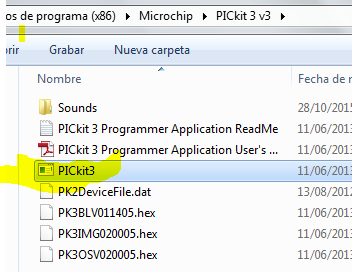
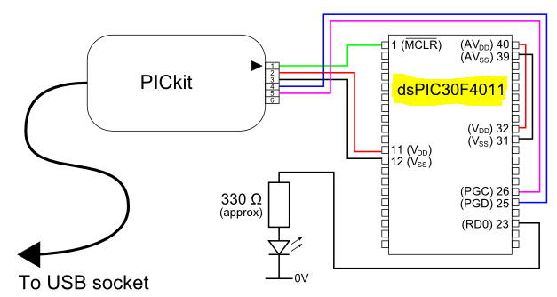

.. -*- coding: utf-8 -*-

.. _rcs_subversion:

Clase 21 - PIII 2019
====================
(Fecha: 8 de noviembre)

**Ejemplo: FFT en entrada en AN8 y envío de datos a través de UART**

- `Descargar desde aquí <https://github.com/cosimani/Curso-PIII-2018/blob/master/resources/clase10/FFTyUART.rar?raw=true>`_

**Ejemplo: FFT en entrada en AN8 y envío de datos a través de UART a una aplicación C++**

- `Descargar desde aquí la aplicación portable <http://www.vayra.com.ar/piii2017/portable.rar>`_

- `Descargar desde aquí el código fuente C++ <http://www.vayra.com.ar/piii2017/fuente.rar>`_

- `Descargar desde aquí el código fuente mikroC <https://github.com/cosimani/Curso-PIII-2019/blob/master/resources/clase21/FFT-AN8-UART.zip?raw=true>`_

- Con este programa probar cómo se generan las bandas laterales en una AM. Tener en cuenta que con los generadores de señales que tenemos, podemos generar una AM.

Grabación de dsPIC con Pickit 3
^^^^^^^^^^^^^^^^^^^^^^^^^^^^^^^

- El Pickit 3 permite programar el dsPIC grabando el archivo .hex compilado con el mikroC
- Requiere el aplicativo programador. `Descargar desde aquí <https://github.com/cosimani/Curso-PIII-2018/blob/master/resources/clase11/PICkit3Setup.rar?raw=true>`_

.. figure:: images/clase11/pickit3_1.png

- Conectar el Pickit 3 a la PC y esperar que instale controladores (la instalación del aplicativo instala los controladores también).

- Para abrirlo ejecutamos:

- Podemos probar conectando la Demo board que viene con el PicKit 3 ( más info en: http://ww1.microchip.com/downloads/en/devicedoc/40001296c.pdf )

- Le damos a Check Comunication y nos detecta la Demo Board conectada:

.. figure:: images/clase10/im6.png

- Si conectamos el circuito de grabación del dsPIC30F3010, también lo detecta:

.. figure:: images/clase10/im7.png

- Se puede leer el dsPIC y grabar el firmware en un .hex y también se puede escribir nuestro .hex creado con mikroC.

- Se conecta de la siguiente manera:

**Ejercicio**

- Hacer un Hola Mundo en mikroC simplemente para hacer parpadear un led. Escribir el programa en mikroC, compilar para generar el hex, grabarlo con el PicKit 3 y por último probarlo en la placa.

