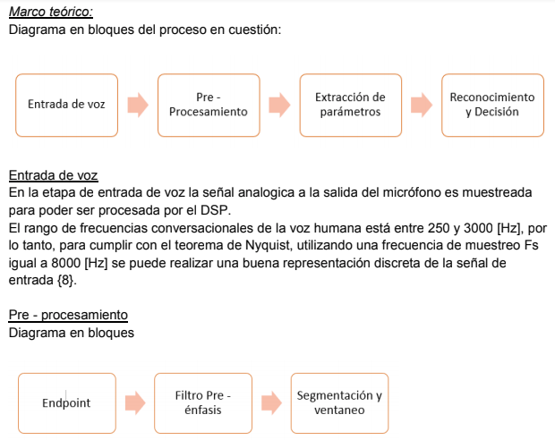

.. -*- coding: utf-8 -*-

.. _rcs_subversion:

Clase 22 - PIII 2018
====================
(Fecha: 21 de noviembre)

Primera entrega de prácticos finales
====================================

**Identificador de tonos DTMF ( Agustina Alvarez - Carlos Ignacio )** 

( Clic sobre la siguiente imagen para abrir el informe en PDF )

.. figure:: resources/clase07/PrimeraEntrega-Agustina-Carlos.png
	:target: resources/clase07/PrimeraEntrega-Agustina-Carlos.pdf

**Reconocimiento de voz ( Karraz Facundo - Gutierrez Julian )** 

( Clic sobre la siguiente imagen para abrir el informe en PDF )

